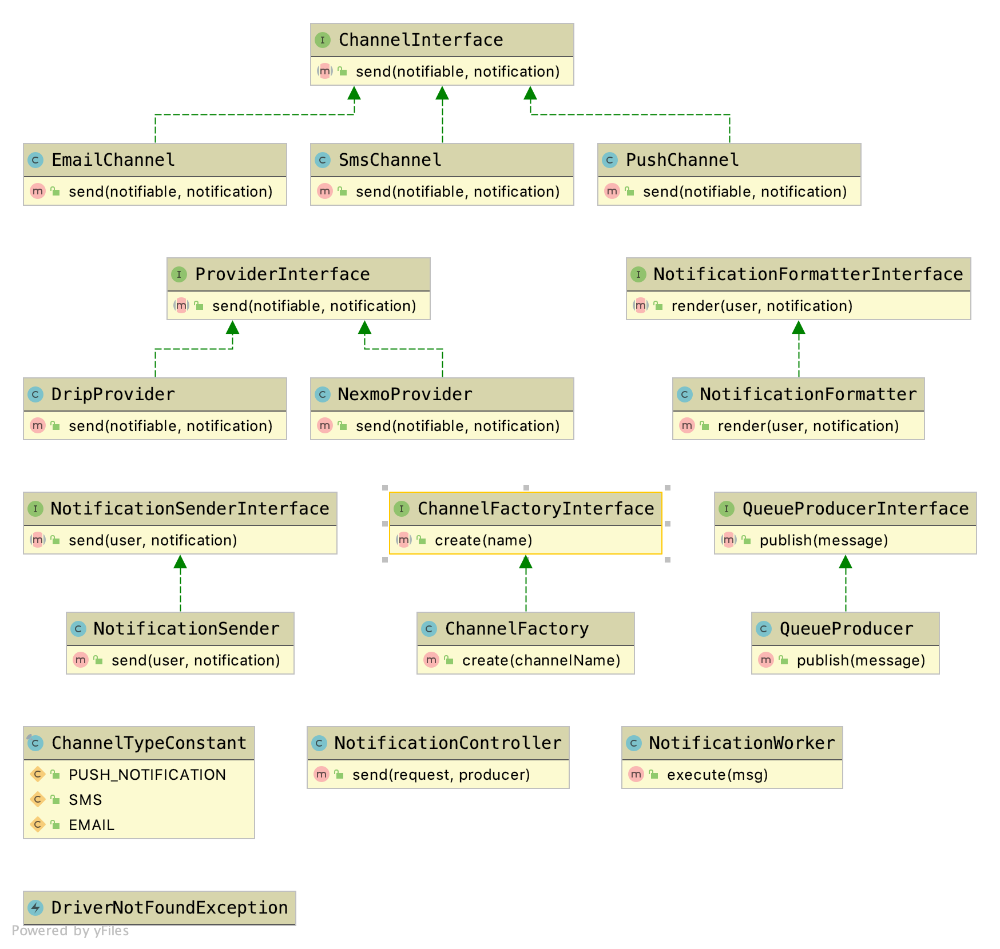

## Notification Service

- I tried to make this service highly cohesive and loosely coupled
so it has only one responsibility and it is publishing the notifications
 through multiple channels depend on multiple third parties. 


### Class diagram




## End point to produce the notifications
- A REST API application to get transactions from multiple provider with criteria

- POST `127.0.0.1:8001/api/notification/send`
- Body 
```json
{
	"users": [
		{"name" : "Hafez", "channel": "email", "locale" : "en", "to" : "00201144688896"},
        {"name" : "Mohamed", "channel": "sms", "locale" : "ar", "to" : "mohamed.hafezqo@gmail.com"},
        {"name" : "Younis", "channel": "sms", "locale" : "en", "to" : "Younis@gmail.com"}
	],
	"notification": {
		"template": "promoCode",
		"discount": "20%",
		"code": "StayHome"
	}
}
```

### Installation

- Create `.env` file from `.env.dist`
- Run `docker-compose build`
- Run `docker-compose up -d`
- Run `docker-compose run php composer install` to install the dependencies.
- Run `docker-compose up`
- Run `docker-compose run php bin/console rabbitmq:consumer send_notifications`


### Built With

* [PHP7.2](http://php.net)
* [Symfony4](http://www.symfony.com) 
* [Rabbitmq](https://www.rabbitmq.com/)
